# 第31.2节 系统安装与基本配置

## 下载

<https://www.beckhoff.com/en-us/search-results/?q=bsd>


点击`↓ ZIP`即可下载。**注意：需要注册才能下载。**

首先解压缩 ZIP，将“TCBSD-x64-13-92446.iso”解压缩出来。

## 创建虚拟硬盘并写入镜像

TCBSD 官方的镜像其实是用 `dd` 做成的，对应的是 FreeBSD 的 img 镜像，所以虚拟机无法直接识别。需要曲线救国，创建一个虚拟的 VHD 硬盘，然后将其挂载到虚拟机中再进行安装。

首先右键单机“这台电脑”，选择管理--磁盘管理--操作--创建 VHD。

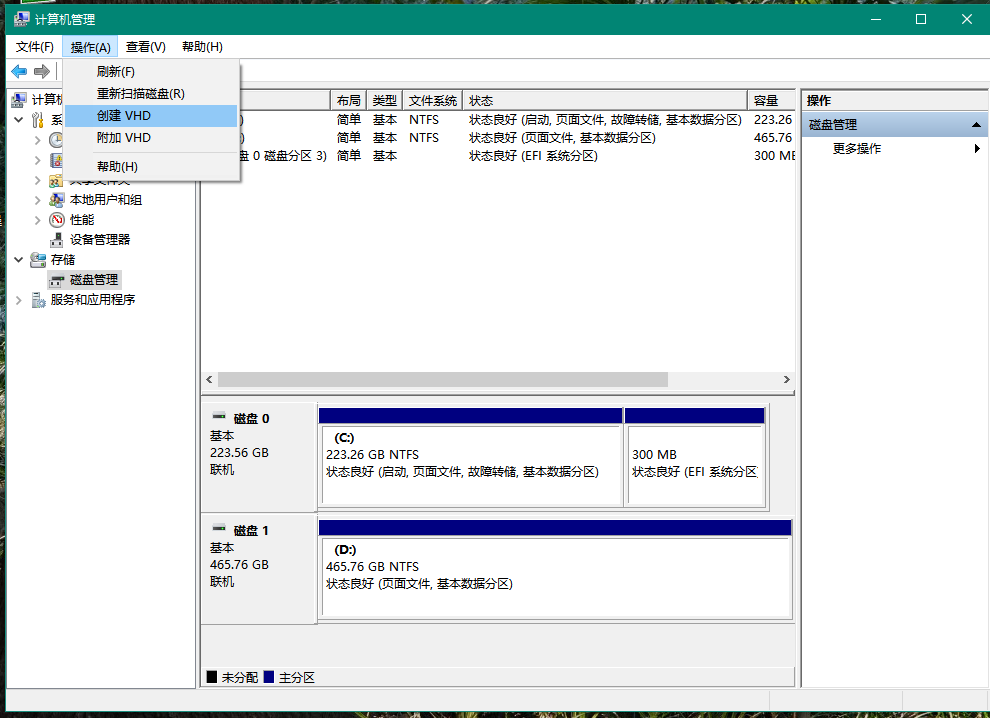

硬盘大小 1GB 即可，多了没用，是用来写入镜像用的。其他配置参考我的设置即可。

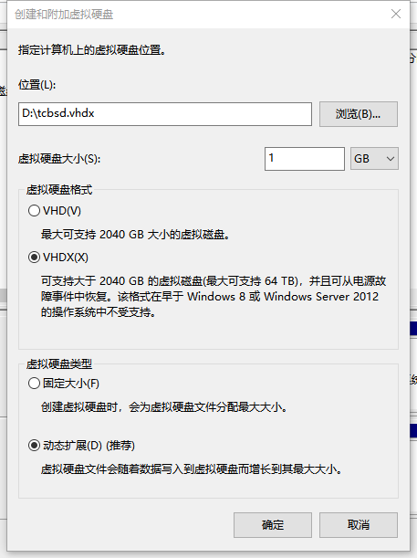

可以看到多出了一个`磁盘 2`，我们右键单机左侧区域--选择“初始化磁盘”。（**注意，我原先有 2 块硬盘，分别是`磁盘 0`和`磁盘 1`。**）

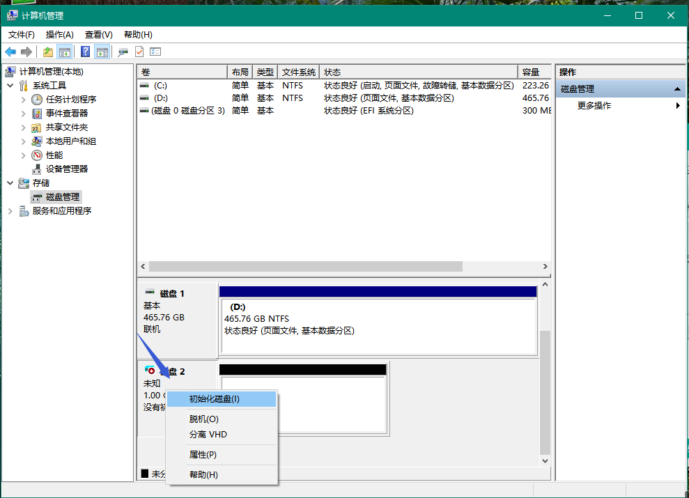

选择默认参数即可。用 GPT 分区表格式化磁盘 2。

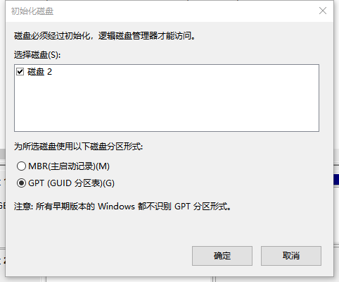

右键单机右侧区域，点击“新建简单卷”，其他保持默认配置即可。

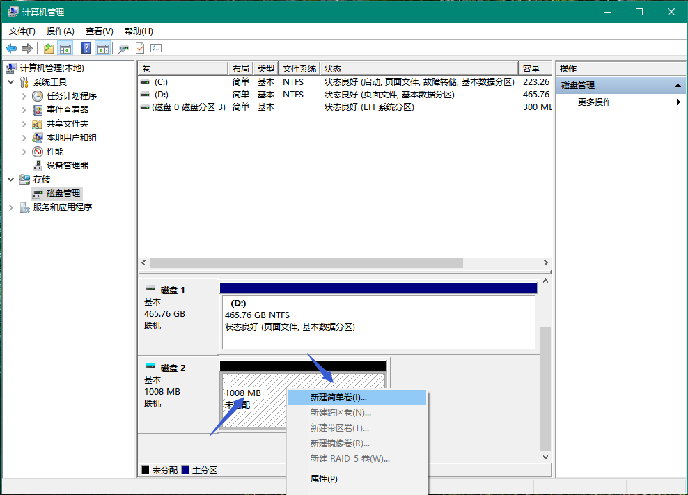

可以看到出来了一个`新加卷 F`：

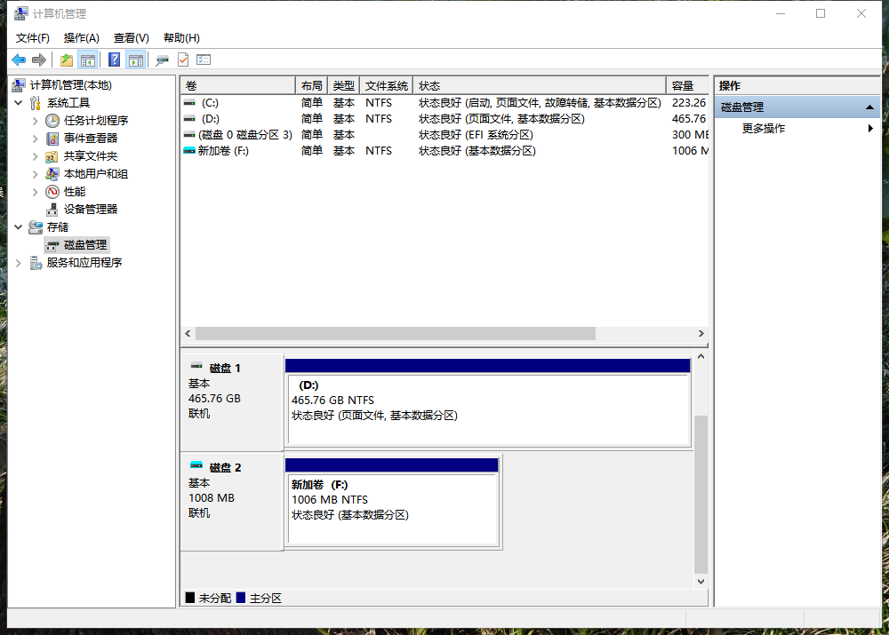

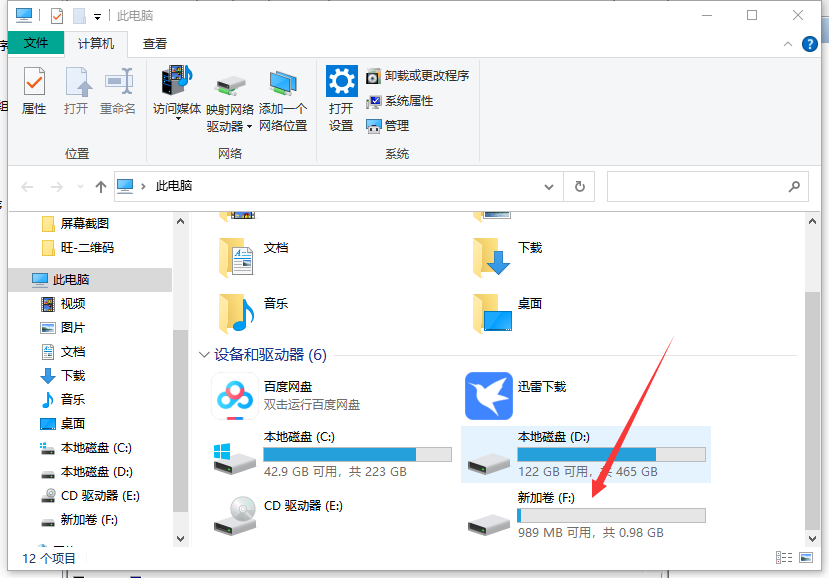

打开 rufus，会自动识别到我们的新加卷 F，选择解压出的镜像 TCBSD-x64-13-92446.iso，点击"开始"即可，在最后一步刷新分区表的时候会等待较长时间，请耐心等待。

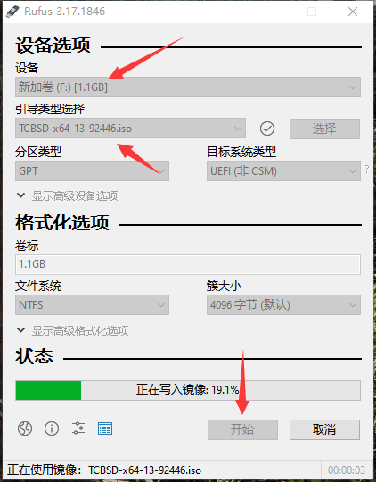

返回磁盘管理，选择“操作”--重新扫描磁盘。**否则下面虚拟机无法加载出磁盘 2。**

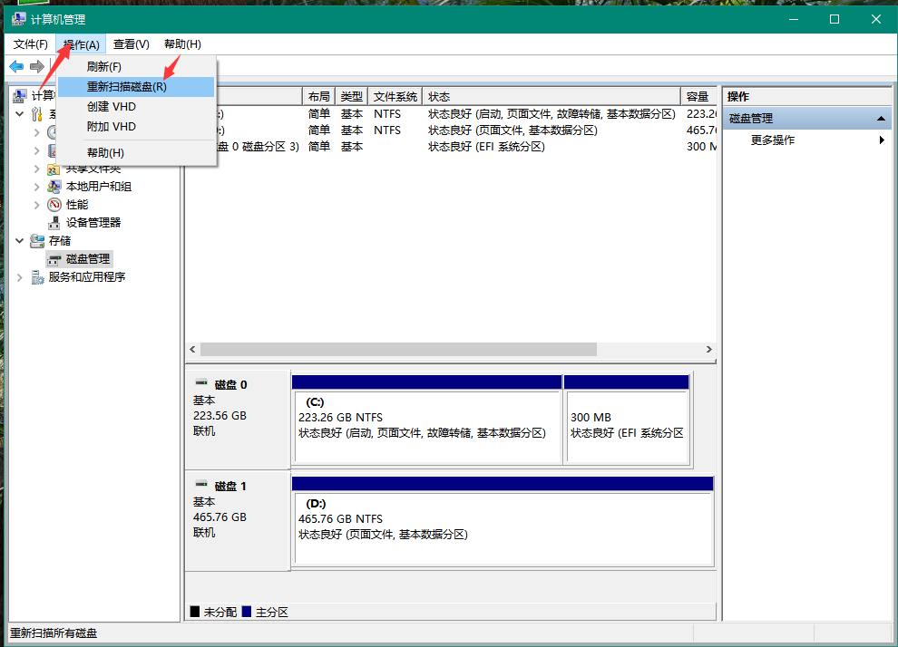

可以看到磁盘 2 已经被写入镜像了：


## VMware VMware Workstation Pro 安装 TCBSD

我们先以正常方法创建一个空白的虚拟机模板，然后点击“虚拟机设置”--“添加”--“硬盘”。点击下一步：


保持默认即可：

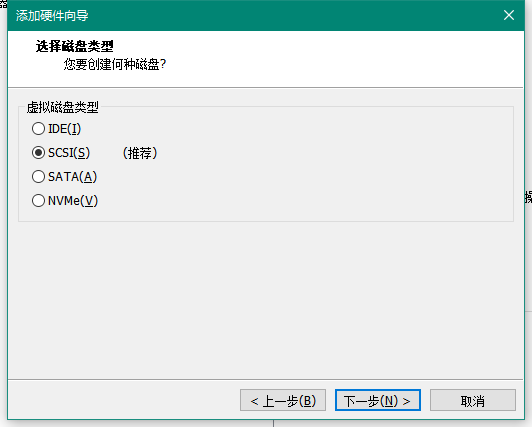

选择第三项“使用物理磁盘”：

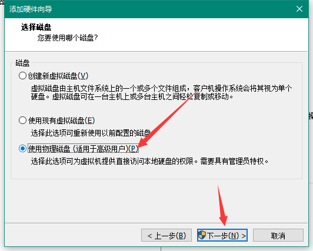

这里选择磁盘 2，并使用整个分区：


保持默认即可：


检查磁盘的大小、名称是否符合，选错了就无法启动。


开启 UEFI：


保存以上配置后开机：

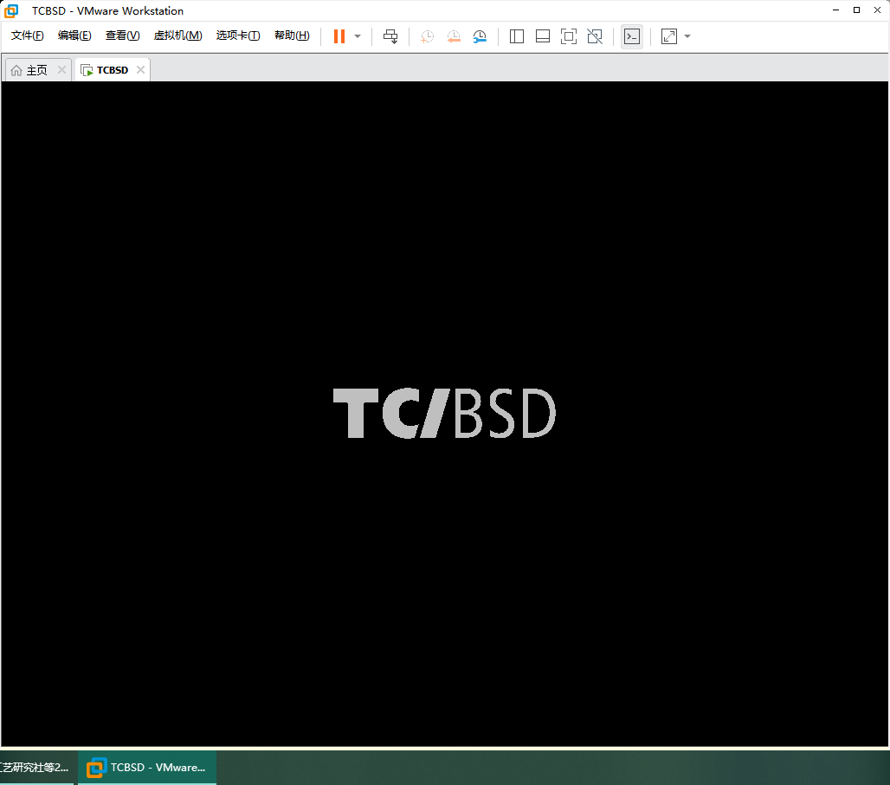

开始安装：


选择磁盘进行安装，看大小就能判断选择哪个：

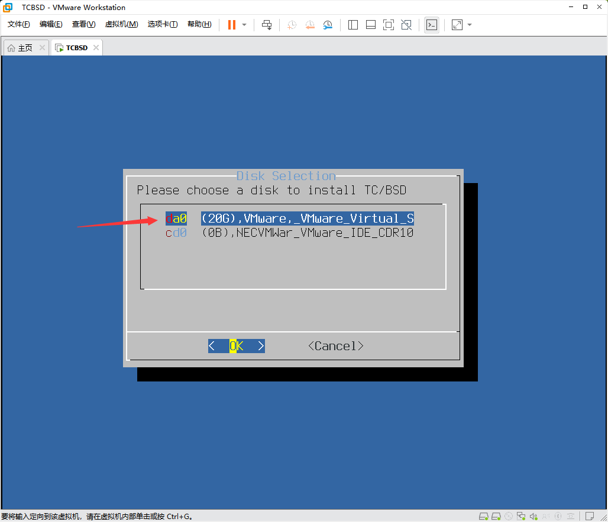

选择“Yes”开始安装：

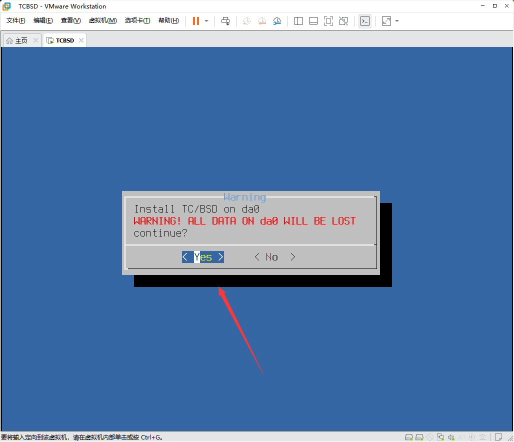

输入 `Administrator` 的密码：

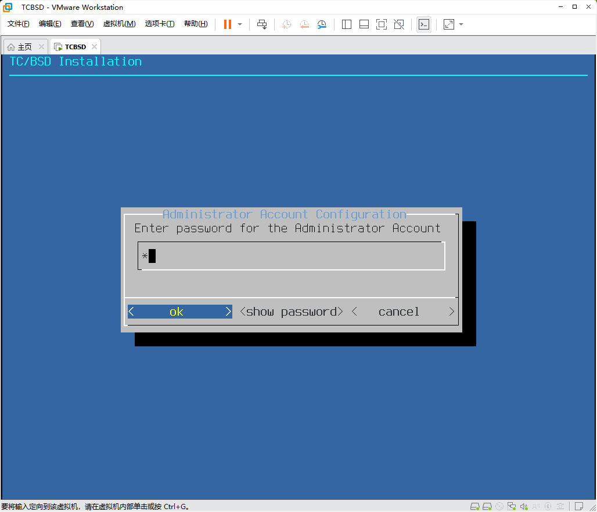

再次输入 `Administrator` 的密码：

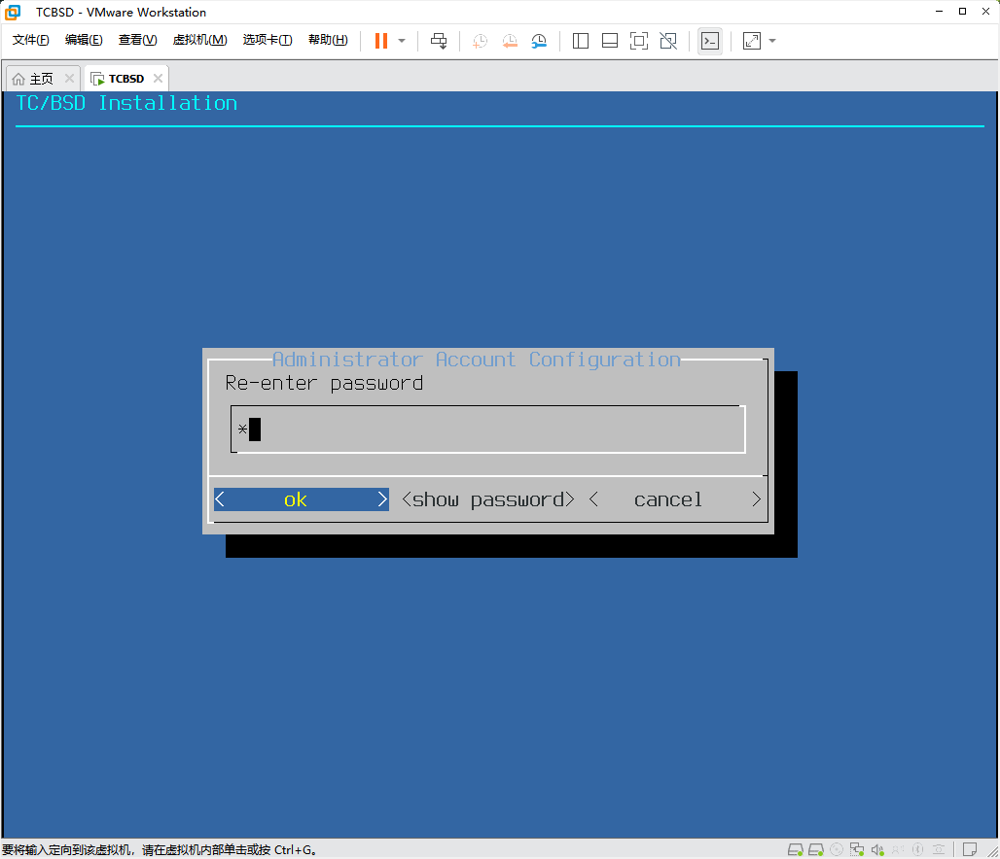

开始安装了：


提示安装完成：


选择“reboot”重启进入安装后的系统：

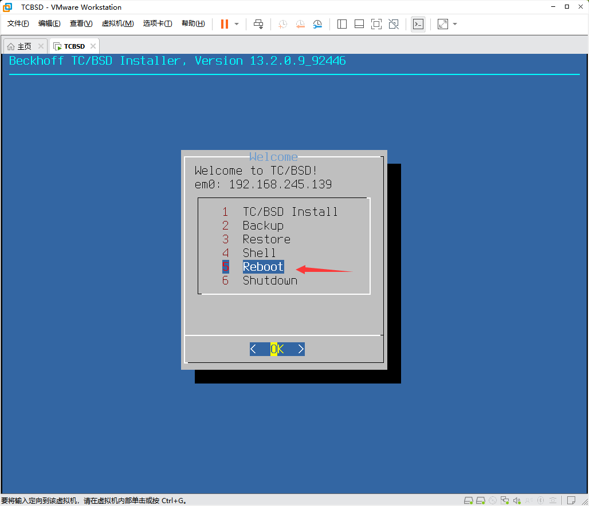


网络链接方式使用 NAT，经过测试桥接无法访问。（注意是 **HTTPS** 不是 HTTP，后者无法访问！）

<https://192.168.xxx.yyy>


## root

默认用户名是 `Administrator`，密码是你在安装时设置的。倍福其他 PLC 默认密码都是 `1`。

首先设置 root 密码：

```
doas passwd root
```

然后就可以

```
doas su
```
