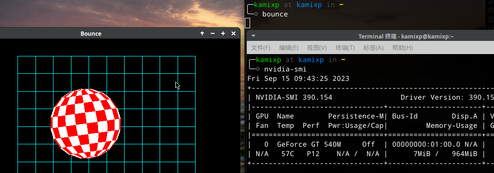
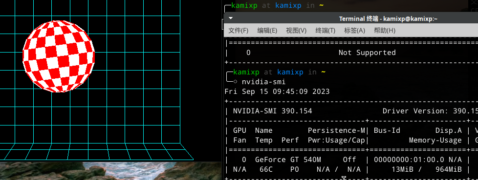
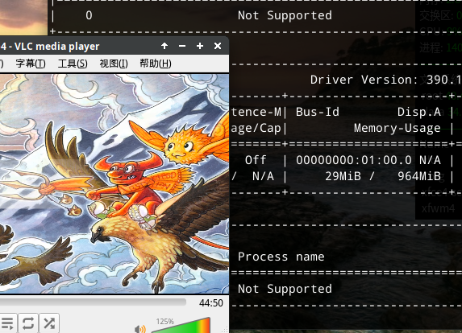

# 第 4.1 节 安装显卡驱动及 Xorg（必看）

**对于没有显卡直通的笔记本，必须安装英特尔 drm！不要上来就安装 Nvidia 然后说打不开。**

FreeBSD 已从 Linux 移植了显卡驱动，理论上，I 卡 A 卡 N 卡均在 AMD64 架构上正常运行。

## 显卡支持情况

对于 FreeBSD 11，支持情况同 Linux 内核 4.11；

对于 FreeBSD 12，支持情况同 Linux 内核 4.16；

对于 FreeBSD 13.1，编译使用`drm-510-kmod`，支持情况同 Linux 5.10。AMD 可支持 R7 4750U【但是有 [bug](https://github.com/freebsd/drm-kmod/issues/72)】。

FreeBSD 14 Current，编译使用 `drm-515-kmod`。**截至 2023.8.24 日，英特尔第 12、 13 代** 显卡 **[**暂不支持**](https://github.com/freebsd/drm-kmod/issues/219)。** 。

详细情况可以看

[https://wiki.freebsd.org/Graphics](https://wiki.freebsd.org/Graphics)

## 英特尔核显 / AMD 独显

### 安装驱动——简单版本（推荐）

首先切换到 latest 源，或使用 ports 安装：

```shell-session
# pkg install drm-kmod
```

或者

```shell-session
# cd /usr/ports/graphics/drm-kmod/ && make BATCH=yes install clean
```

> 注意：
>
> `graphics/drm-kmod` 这个包并不是真实存在的，他只是帮助判断系统版本以安装对应的 ports 包的元包。
>
> 即使是像英特尔三代处理器的 HD 4000 这种比较古老的显卡，他在传统的 BIOS 模式下不需要额外安装显卡驱动，但是 UEFI 下有可能会花屏（FreeBSD 13.0 及以后无此问题），而且需要安装此 DRM 显卡驱动。

> **故障排除：**
>
> - **如果提示内核版本不符（`KLD XXX.ko depends on kernel - not available or version mismatch.`），请先升级系统或使用 ports 编译安装：**
>
> 
>
> - **如果提示 `/usr/ports/xxx no such xxx` 找不到路径，请先获取 ports 请看前文。**

### 安装驱动——复杂版本

注意，如果要通过 `ports` 安装提示需要源码，请见第二十一章。

- FreeBSD 12

```shell-session
# cd /usr/ports/graphics/drm-fbsd12.0-kmod/ && make BATCH=yes install clean
```

> **注意：**
>
> **除了 12.0，对于任意 12.X 均应该安装 `drm-fbsd12.0-kmod`，但应该使用 port 在本地重新构建而不应使用 pkg 进行安装，否则不会正常运行。**

- FreeBSD 13

```shell-session
# cd /usr/ports/graphics/drm-510-kmod/ && make BATCH=yes install clean
```

- FreeBSD 14 (current）

```shell-session
# cd /usr/ports/graphics/drm-515-kmod/ && make BATCH=yes install clean
```

### 加载显卡

> **无论是使用以上哪个方法，都需要进行这一步配置。**

打开 `/etc/rc.conf`:

- 如果为 intel 核芯显卡，添加 `kld_list="i915kms"`
- AMD
  - 如果为 HD7000 以后的 AMD 显卡，添加 `kld_list="amdgpu"` （大部分人应该使用这个，如果没用再去使用`radeonkms`）
  - 如果为 HD7000 以前的 AMD 显卡，添加 `kld_list="radeonkms"` （这是十余年前的显卡了）

### 视频硬解

`# pkg install xf86-video-intel libva-intel-driver`

### 亮度调节

#### 通用

一般计算机：

```shell-session
# sysrc -f /boot/loader.conf  acpi_video="YES"
```

对于 Thinkpad：

```shell-session
# sysrc -f /boot/loader.conf  acpi_ibm_load="YES"
# sysrc -f /boot/loader.conf  acpi_video="YES"
```

> 仅限 FreeBSD 13

```shell-session
# backlight decr 20  #降低 20% 亮度
```

#### 英特尔

```shell-session
# pkg install intel-backlight
# intel-backlight 80 #调整为 80% 亮度
```

## AMD 显卡

> 此部分教程经过测试适用于 renoir 显卡。
>
> 在使用 Gnome 时，如果自动锁屏或息屏，可能无法再次进入桌面。见 [https://bugs.freebsd.org/bugzilla/show_bug.cgi?id=255049](https://bugs.freebsd.org/bugzilla/show_bug.cgi?id=255049)。

安装所需驱动（均为 latest 源或从 ports 安装）：

```shell-session
# pkg install drm-510-kmod gpu-firmware-kmod xf86-video-amdgpu
```

新建并编辑 xorg 配置文件：

```shell-session
# ee /usr/local/etc/X11/xorg.conf.d/06-driver.conf
```

加入（**注意 BusID 要改成你自己的，使用`pciconf -l`即可查看**）：

```shell-session
Section "Device"
    Identifier  "Card 0"
    Option      "AccelMethod" "exa"
EndSection
```

## 英伟达显卡

### 笔记本核显

请先按照上边的方法配置核显，也就是说不能单独用 nvidia 打开 xorg。


- 旧显卡：
  - nvidia-hybrid-graphics-390   用于支持双显卡切换
  - nvidia-secondary-driver-390 对应显卡驱动
- 
390 驱动支持的显卡参考[https://www.nvidia.cn/download/driverResults.aspx/196293/cn/](https://www.nvidia.cn/download/driverResults.aspx/196293/cn/),支持一些旧显卡.

- 新显卡：
  - nvidia-hybrid-graphics  用于支持双显卡切换
  - nvidia-secondary-driver  对应显卡驱动

```shell-session
# sysrc kld_list+=nvidia-modeset
# sysrc nvidia_xorg_enable=YES
```

开机后在 kde 设置里查看显卡默认用的是 intel 核显，终端里 `nvidia-smi` 只有 `nvidia-xorg-service 8MB`。

然后在终端用这个命令调用 N 卡：

```shell-session
$ nvrun 程序名 # 默认无 GUI 运行
$ nvrun-vgl 程序名 # GUI 运行程序
```

mesa-demos  包含一些 opengl 示例，可用于测试驱动是否可用，非必要安装。

kld_list 中 `nvidia-modeset`  和 `i915kms` 需同时存在

安装包后如果 xorg 启动成功不需额外配置，如果失败用 `pciconf -lv` 查找显卡的 busid，例如

```shell-session
vgapci0@pci0:1:0:0:	class=0x030000 rev=0xa1 hdr=0x00 vendor=0x10de device=0x0df4 subvendor=0x1043 subdevice=0x15f2
    vendor     = 'NVIDIA Corporation'
    device     = 'GF108M [GeForce GT 540M]'
    class      = display
    subclass   = VGA
```

在 `/usr/local/etc/X11/xorg-nvidia-headless.conf` 找到 `Device` 一节，并对应修改 BusID ,上面 ”pci0:1:0:0“ 

```shell-session
Section "Device"
    Identifier     "Device0"
    Driver         "nvidia"
    BusID          "PCI:1:0:0"
EndSection
```

检验是否成功启用独显，可以用 mesa-demos 中程序测试，运行`bounce`，用 `nvidia-smi -l 1` 观察(每隔一秒刷新一次)。没有使用 nvidia 驱动时显存使用 7M，启用程序显存没有变化。




 运行 `nvrun-vgl bounce` 用 `nvidia-smi -l 1` 观察
 
 使用 nvidia 驱动时显存使用 13M
 
 
 
#### 开启 vlc 硬解

```shell-session
pkg install libva-vdpau-driver libvdpau libvdpau-va-gl
```

工具->偏好设置->输入/编解码器->硬件加速解码：选择VDPAU 视频解码器


用 `nvrun-vgl vlc` 启动 vlc，并播放视频




显存使用上升，正在使用硬解

### 独显直连或台式机

注意，有多个版本的 N 卡驱动，不知道该用哪个的去看[手册](https://handbook.bsdcn.org/di-5-zhang-xwindow-xi-tong/5.3.-xian-ka-qu-dong.html)。

```shell-session
# pkg install nvidia-driver nvidia-settings nvidia-xconfig nvidia-drm-kmod#安装几个 nvidia 相关的包
# sysrc kld_list+="nvidia-modeset nvidia-drm.ko" #配置驱动
# reboot #重启
```
**如果找不到 `graphics/nvidia-drm-kmod` 就编译安装，该包提供了 PRIME 等支持。`**

这时候应该已经可以驱动显卡了。

```shell-session
# 查看驱动信息
$ nvidia-smi
```

如果发现系统没有使用 nvidia 驱动需要自动生成配置文件：

```shell-session
# Xorg -configure #生成配置文件。注意，该步骤不是必要！
# cp /root/xorg.conf.new /etc/X11/xorg.conf
```

然后重新启动就可以发现正常使用 nvidia 驱动了

**注意**： 默认情况下，通过 pkg 安装的 nvidia-driver 是包含 Linux 兼容层支持的, 如果要使用 Linux 软件，需要执行以下命令，（实际上使用 linux 兼容层，以下命令是必须的。） 如果不需要使用 Linux 兼容层，则不需要执行。

```shell-session
# sysrc linux_enable="YES"
```

当然如果使用官方的 pkg 软件包，安装好驱动重启后：

```shell-session
$ kldstat
```

会发现系统自动加载了 `linux.ko` 模块。如果觉得太臃肿，不需要 Linux 兼容层 可以自己通过 ports 编译 `nvidia-driver`,去掉 `linux compatibility support`。

## 拉取开发版 drm-kmod（仅限 FreeBSD-CURRENT）

> **警告**
>
> 此部分属于实验性内容且仅限 FreeBSD-CURRENT 使用，不建议新手操作。
>
> **请提前在 /usr/src 准备好一份系统源码。**

拉取最新的 drm-kmod 并编译安装：

```shell-session
# pkg install git
$ git clone --depth=1 https://github.com/dumbbell/drm-kmod/
$ cd freebsd/drm-kmod
$ git checkout -b update-to-v5.17
$ make
…
# make install
===> linuxkpi (install)
install -T release -o root -g wheel -m 555   linuxkpi_gplv2.ko /boot/modules/
===> ttm (install)
install -T release -o root -g wheel -m 555   ttm.ko /boot/modules/
===> drm (install)
install -T release -o root -g wheel -m 555   drm.ko /boot/modules/
===> amd (install)
===> amd/amdgpu (install)
install -T release -o root -g wheel -m 555   amdgpu.ko /boot/modules/
===> radeon (install)
install -T release -o root -g wheel -m 555   radeonkms.ko /boot/modules/
===> i915 (install)
install -T release -o root -g wheel -m 555   i915kms.ko /boot/modules/
kldxref /boot/modules
```

参考资料

- [https://github.com/freebsd/drm-kmod/issues/93#issuecomment-962622626](https://github.com/freebsd/drm-kmod/issues/93#issuecomment-962622626)

### 故障排除

- 如果显卡使用驱动有问题请直接联系作者：[https://github.com/freebsd/drm-kmod/issues](https://github.com/freebsd/drm-kmod/issues)
- 如果笔记本出现了唤醒时屏幕点不亮的问题，可以在 `/boot/loader.conf` 中添加 `hw.acpi.reset_video="1"` 以在唤醒时重置显示适配器。

## 安装 xorg

### 可选软件包：

xorg 完整包: xorg

xorg 最小化包: xorg-minimal（不建议）

### 安装

通过 pkg 安装

`# pkg install xorg`

通过 ports 安装

```shell-session
# cd /usr/ports/x11/xorg
# make install clean
```

### 故障排除

**总有人试图手动生成`xorg.conf`这个文件，这是非常错误的行为！你打不开桌面很大概率不是因为这个文件的配置有问题！你应该去检查显卡驱动或者桌面本身的问题。Xorg 几乎是不会出问题的！**

