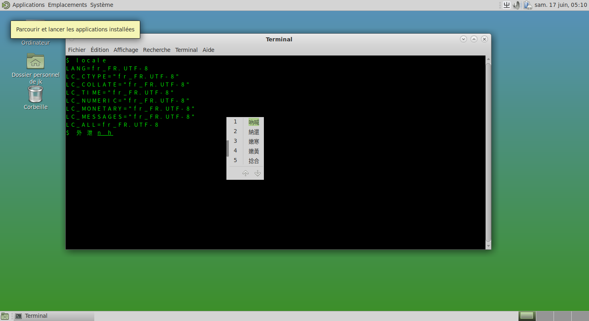

# 第 5.1 节 Fcitx 输入法框架

> **注意**
>
> 在 FreeBSD-14.0-Current 中可能会出现许多不可预料的奇怪的 bug（fcitx5 诊断信息英文乱码，输入法显示出奇怪的汉字，fcitx5-qt5 环境不能正常加载……），如果条件允许应该在 FreeBSD-Release 中参考使用本文。

## Fcitx 4.X

> **注意**
>
> 该教程仅在 KDE 5/csh 下测试通过。

`# pkg install zh-fcitx zh-fcitx-configtool fcitx-qt5 fcitx-m17n zh-fcitx-libpinyin`

在 `.cshrc` 和 `/etc/csh.cshrc` 中添加如下配置，此配置可以解决部分窗口 fcitx 无效的问题。

```
setenv QT4_IM_MODULE fcitx
setenv GTK_IM_MODULE fcitx
setenv QT_IM_MODULE fcitx
setenv GTK2_IM_MODULE fcitx
setenv GTK3_IM_MODULE fcitx
setenv XMODIFIERS @im=fcitx
```

在 `.cshrc` 和 `/etc/csh.cshrc` 中添加下面几行配置可以解决终端无法输入中文和无法显示中文的问题。

```
setenv LANG zh_CN.UTF-8
setenv MM_CHARSET zh_CN.UTF-8
setenv LC_CTYPE zh_CN.UTF-8
setenv LC_ALL zh_CN.UTF-8
```

自动启动：

`# cp /usr/local/share/applications/fcitx.desktop ~/.config/autostart/`

## Fcitx 5.X

fcitx 5 相比前一代，增加了对 Wayland 的支持，据说更加流畅。

```
# pkg install fcitx5 fcitx5-qt5 fcitx5-qt6 fcitx5-gtk2 fcitx5-gtk3 fcitx5-gtk4 fcitx5-configtool zh-fcitx5-chinese-addons
```

`fcitx5-configtool`是 fcitx5 的图形配置工具。

也可通过 ports 安装。环境变量取决于你的窗口管理器和桌面以及 shell。经测试不支持 slim，可能是配置问题。sddm 可用。

> **可选**
>
> 你还可以选择安装 rime，`#pkg install zh-fcitx5-rime zh-rime-essay`。rime 不会自动被添加到输入法，需要手动添加完成初始化（程序里找到 fcitx 配置工具，添加 rime 输入法即可），这个输入法我不知道配置文件在哪，有意者可以自行安装。而且经常切换到繁体，即使你选择了简体，BUG 比较多，原因未知。对于普通用户如果未生效，请检查自己的 shell 是否选择了对应教程进行设置。另外请将该用户加入 wheel 组。

SLIM 窗口下会提示 IBUS 找不到……疑似 bug。

自动启动：

```
# mkdir -p ~/.config/autostart/ #若使用其他用户则需要在其命令行下再执行之。
# cp /usr/local/share/applications/org.fcitx.Fcitx5.desktop ~/.config/autostart/
```

### 根据 Shell 设置环境变量

#### 如何查看修改当前 shell

先看看现在的 shell 是什么: `# echo $0`。

例：尝试将当前 shell 修改成 `csh`：

```
# chsh -s /bin/csh
```

退出当前账号，重新登录，查看 shell 是否变为 `csh`：

```
# echo $0
```

如果输出`csh`，代表配置成功。然后其余环境变量配置方法同上所述。

#### 设置环境变量

根据自己使用的桌面管理器择一使用：

1. sddm lightdm gdm 都可以在 `~/.xprofile` 中写入 A 组配置
2. lightdm gdm 可以在 `~/.profile` 中写入 A 组配置
3. sddm 可以在用户登录 shell 配置文件中写入配置

- sh: `~/.profile` 写入 A 组配置
- bash: `~/.bash_profile` 或 `~/.profile` 写入 A 组配置
- zsh: `~/.zprofile` 写入 A 组配置
- csh: `~/.cshrc` 写入 B 组配置

**注意：如果登录桌面的用户不是 root，就不能使用 root 进行设置，必须切换到当前用户且不使用 sudo 进行配置。**

A 组：

sh/bash/zsh:fcitx5

```
export LANG=zh_CN.UTF-8
export LANGUAGE=zh_CN.UTF-8
export LC_ALL=zh_CN.UTF-8

export XMODIFIERS='@im=fcitx'
export GTK_IM_MODULE=fcitx/xim
export QT_IM_MODULE=fcitx
```

B 组：

csh:fcitx5

```
setenv LANG zh_CN.UTF-8
setenv LC_ALL zh_CN.UTF-8
setenv LANGUAGE zh_CN.UTF-8
setenv XMODIFIERS @im=fcitx
setenv GTK_IM_MODULE fcitx/xim
setenv QT_IM_MODULE fcitx
```

## 故障排除

遇到问题，请先运行 `fcitx` 故障诊断，但是该输出仅对 `bash` 做了环境变量的配置。 也就是说他输出的环境变量仅适用于 `bash`、`sh`和`zsh` 等 SHELL，而不适用于 `csh`。于 `csh` 的环境变量配置需要参考上文。

如果提示 `bash` 字样且无法输出诊断信息，则需要先安装 `bash`：`# pkg install bash`

### fcitx 4.x

```
# fcitx-diagnose
```

对于 fcitx 4.x 来说，找不到 `GTK 4` 的支持是正常的。

### fcitx 5.x

```
# fcitx5-diagnose
```

对于 fcitx 5.x 来说，找不到 `fcitx qt 4` 的支持是正常的。

# 第 5.2 节 Ibus 输入法框架

## ibus

基本安装

```
# pkg install ibus zh-ibus-pinyin
```

其中 `zh-ibus-pinyin` 为拼音输入法

可选的还有

- `zh-ibus-cangjie` 仓颉输入法
- `zh-ibus-chewing` 酷音输入法
- `zh-ibus-rime` rime 输入法引擎（另述）
- `zh-ibus-table-chinese` 包含五笔、仓颉等多种输入法

## 环境变量配置

1. sddm lightdm gdm 都可以在 `~/.xprofile` 中写入 A 组配置
2. lightdm gdm 可以在 `~/.profile` 中写入 A 组配置
3. sddm 可以在用户登录 shell 配置文件中写入配置

- sh: `~/.profile` 写入 A 组配置
- bash: `~/.bash_profile` 或 `~/.profile` 写入 A 组配置
- zsh: `~/.zprofile` 写入 A 组配置
- csh: `~/.cshrc` 写入 B 组配置

注销后登录，直接点击 ibus 图标加入自己的输入法后，即可使用,不需配置,不须中文化设置（测试环境 sddm/xfce/freebsd 13.2/sh）。但是 ibus 提示应当在相应的 shell 文件(具体文件另述）中加入以下内容

A 组：

```
#A 组 在 sh、bash、zsh 中
export XIM=ibus
export GTK_IM_MODULE=ibus
export QT_IM_MODULE=ibus
export XMODIFIERS=@im=ibus
export XIM_PROGRAM="ibus-daemon"
export XIM_ARGS="--daemonize --xim"
```

或 B 组：

```
#B组 在 csh 中
setenv XIM ibus
setenv GTK_IM_MODULE ibus
setenv QT_IM_MODULE ibus
setenv XMODIFIERS @im=ibus
setenv XIM_PROGRAM ibus-daemon
setenv XIM_ARGS "--daemonize --xim"
```

这里，建议按 ibus 的建议加入相应内容，以确保在更多的程序中使用时的兼容性。

以前是要配置的现在默认可以不配置，这里我注意到 FreeBSD 13 中 `LC_*`,及`LANG`环境变量的默认值为`"C.UTF-8"`,原来这些环境变量的默认值是`"C"`,这个变化从 FreeBSD 12 开始(chatgpt 查询所得)。所以现在的情况下默认已指定字符编码为`UTF-8`,这可能是 ibus 不需要设置的原因。之前没注意到，或是因为不作汉化使用输入法的情况是很少见的，或是因为来自于 FreeBSD 12 之前的习惯做了环境变量设置而未意识到，或者是之前 ibus 对环境变量的要求比与现在有区别。这里以 lightdm/mate/ibus/rime 环境,`LANG`,`LANGUAGE`,`LC_ALL`设置为`"fr_Fr.UTF-8"`，维持字符编码为`UTF-8`，仍可以正常输入中文，可见 ibus 对编码设置有要求，但对区域设置并无要求

