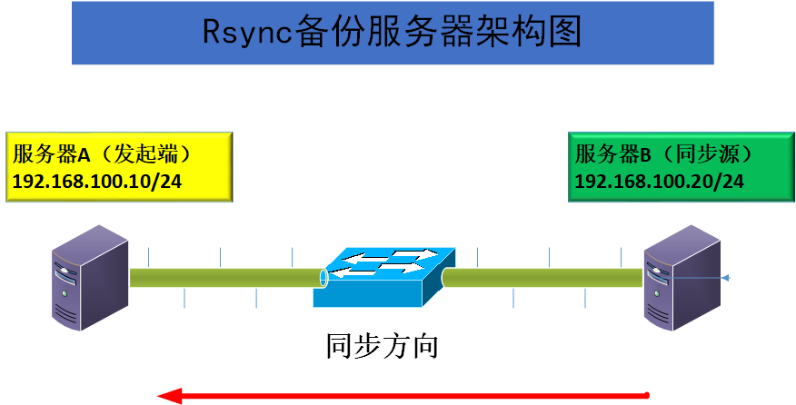

# 第十一节 rsync 同步服务



## 环境介绍

服务器 A、服务器 B 均为 `FreeBSD-12.2-RELEASE-amd64`

服务器 A（发起端）：`192.168.100.10/24`

服务器 B（同步源）：`192.168.100.20/24`

**需求** ：实现服务器B的数据同步到服务器 A 上

## 服务器 B（同步源）配置

### 安装 rsync 软件包

```
# pkg install -y rsync
```

### 查询已安装 rsync 软件包的信息

```
# pkg info | grep rsync 
rsync-3.2.3            
```

### 新建需要备份的文件夹 `test`，并且设置其属主为 `root`，以及在其内部新建测试文件

```
# mkdir test
# chown root /home/test/
# cd /home/test/
# touch txt001
```

### 编辑 `rsyncd.conf` 文件

```
# ee /usr/local/etc/rsync/rsyncd.conf

uid = root
#服务端操作系统的用户
gid = wheel
#服务端操作系统的用户的组
use chroot = yes
#禁锢在源目录
address = 192.168.100.20
#监听地址
port 873
#用于通信的 TCP 端口，缺省是 873
log file = /var/log/rsyncd.log
#日志文件位置
pid file = /var/run/rsyncd.pid
#存档进程 ID 的文件位置
hosts allow = 192.168.100.0/24
#允许访问的客户机地址

[testcom]
#共享模块名称，自定义的名称，不一定要与同步目录相同
path = /home/test
#同步的目录名，必须是  uid 参数指定的用户和 gid 参数指定的组
comment = testcombackup
#模块说明文字     
read only = yes
#是否为只读
dont compress   = *.gz *.tgz *.zip *.z *.Z *.rpm *.deb *.bz2
#同步时不再压缩的文件类型

auth users = root
#授权账户
secrets file = /etc/rsyncd_users.db
#定义rsync客户端用户认证的密码文件
```

### 创建授权备份账户认证的密码文件(服务端)

```
# ee /etc/rsyncd_users.db

root:12345678          #格式为 授权账户用户名：密码。支持多个用户，一行一个即可。
```

#### 修改数据文件权限

```
# chmod 600 /etc/rsyncd_users.db
```

**rsync 的服务名是 rsyncd，启动 rsync 服务程序**

```
# rsync --daemon    #启动服务

# sysrc rsyncd_enable="YES"  #设置开机自启动

# /usr/local/etc/rc.d/rsyncd start #启动服务
```

#### **查看 rsync 运行端口号**

```
# sockstat | grep rsync
root     rsync      1185  4  dgram  -> /var/run/logpriv
root     rsync      1185  5  tcp4   192.168.100.20:873    *:* 
```

#### **防火墙放行 rsync 服务**

```
# ee /etc/ipfw.rules 

IPF="ipfw -q add"
ipfw -q -f flush

#loopback 
$IPF 10 allow all from any to any via lo0
$IPF 20 deny all from any to 127.0.0.0/8
$IPF 30 deny all from 127.0.0.0/8 to any
$IPF 40 deny tcp from any to any frag

# statefull
$IPF 50 check-state
$IPF 60 allow tcp from any to any established
$IPF 70 allow all from any to any out keep-state
$IPF 80 allow icmp from any to any

# open port for ssh
$IPF 110 allow tcp from any to any 22 out
$IPF 120 allow tcp from any to any 22 in

# open port for rsync
$IPF 130 allow tcp from any to any 873 in  

# deny and log everything 
$IPF 500 deny log all from any to any
```

## 服务器 A（发起端）配置

### 创建本地文件夹 `/home/testBackUp/` 并设置好相关权限

```
# mkdir testBackUp
# chown root:root testBackUp
```

### 发起端访问同步源，将文件下载到本地 `/home/testBackUp/` 下载目录下，需要人机交互手动输入密码

```
# rsync -avz root@192.168.100.20::testcom /home/testBackUp     
```
`testcom` 是要从服务器同步的目录，由上方 `/usr/local/etc/rsync/rsyncd.conf` 自定义。

>**指定密码文件方式**
>
>创建授权备份账户认证的密码文件(客户端)
>
>```
># ee /etc/rsyncd_users.db
>
>12345678          #格式：密码
>```
>进行同步：
>```
># rsync -auvz --progress --password-file=/etc/rsyncd_users.db root@192.168.100.20::testcom /home/testBackUp
>```

### 查看同步情况

```
# ls -l /home/testBackUp/
total 0
-rw-r--r-- 1 root root 0 Feb  2 22:27 txt001
```
